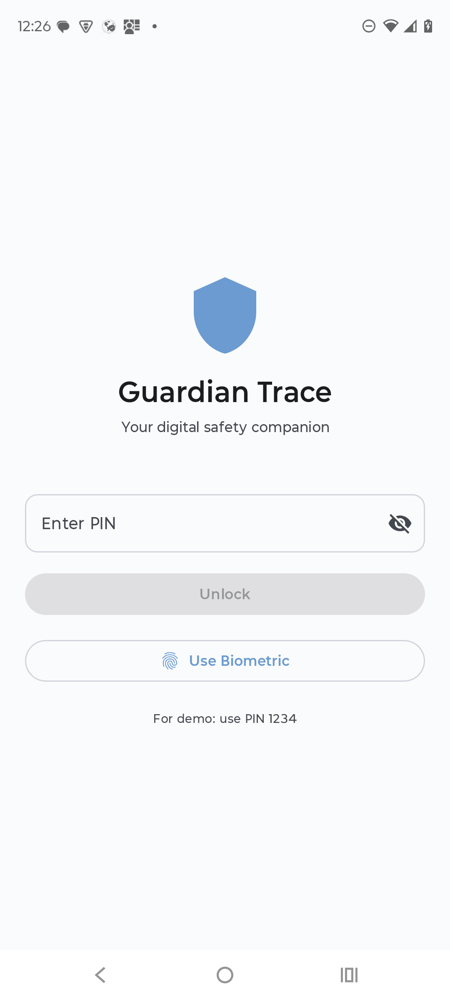
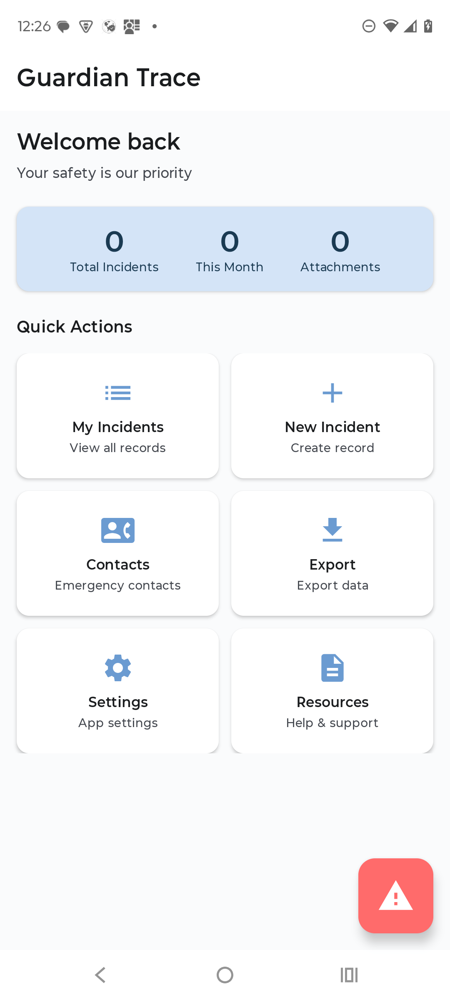
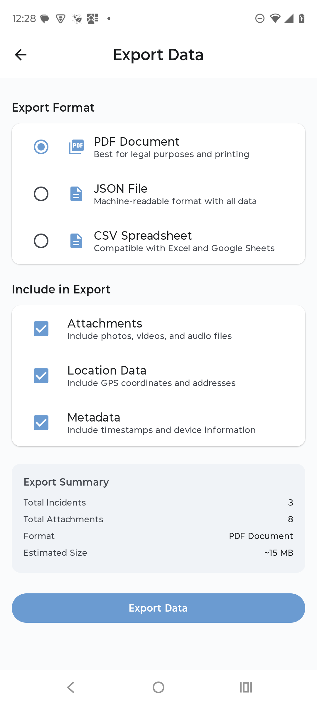
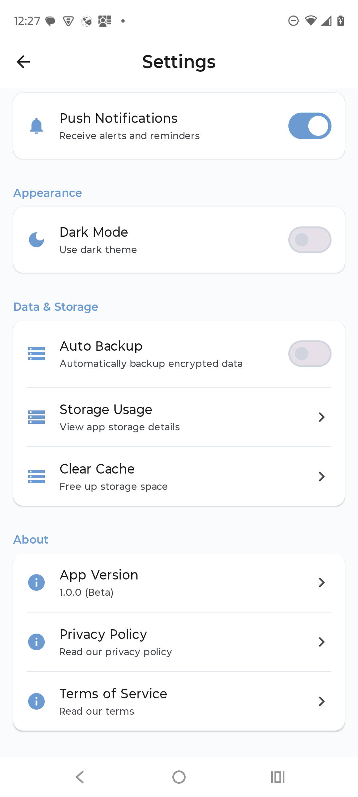

# Guardian Trace - Stalking & Harassment Evidence Recorder

## **Project Overview**

Guardian Trace empowers users to safely record incidents of stalking or online harassment. The app
includes **emergency capture**, **stealth mode**, **secure encrypted storage**, and **fast evidence
export** for legal or safety purposes.

## **Development Stages**

### **1. Concept & Objectives**

* Define the main purpose: protecting users by gathering and securing harassment evidence.
* Prioritize privacy, stealth, and emergency usability.
* Identify user scenarios and risk contexts.

---

### **2. Core Features**

* **Emergency Capture:** Quick-save screenshots, recordings, or text logs.
* **Encrypted Storage:** Evidence stored in a secure Room database using encryption.
* **Stealth Mode:** Mask the app's appearance and hide sensitive actions.
* **SOS Function:** One-tap emergency feature.
* **Evidence Export:** Securely export files and logs.
* **Background Event Logging:** Monitor selected activities in the background.

---

### **3. Technical Architecture**

* **Language:** Kotlin
* **UI:** Jetpack Compose
* **Architecture:** MVVM + Clean Architecture
* **Data Storage:** Encrypted Room Database
* **Layers:**
    * **Data Layer:** Room, Data Sources, DTOs
    * **Domain Layer:** Use Cases, Models
    * **Presentation Layer:** ViewModel, State, StateConverter, Composables
* **Dependency Injection:** Hilt or Koin
* Ensures the **ViewModel never accesses the UI directly**.

---

### **4. UI/UX Design**

* Create wireframes for:
    * Home
    * Capture Screen
    * Evidence List
    * Evidence Details
    * Settings
    * SOS & Stealth Mode
* Prioritize a **minimalist** and **discreet** interface.
* Ensure accessibility and fast emergency navigation.

---

### **5. Security Layer**

* Full database encryption for stored evidence.
* Secure export handling (metadata, tamper-proof logs).
* Configurable stealth behaviors.
* Optional PIN or biometric access.

---

### **6. Development Workflow**

1. Initialize Kotlin + Compose project.
2. Create modular architecture (data, domain, presentation).
3. Implement encrypted Room + repositories.
4. Build feature modules incrementally.
5. Apply Google best practices and Clean Code principles consistently.
6. Add dependency injection.
7. Integrate security and stealth functionalities.

---

### **7. Testing & Validation**

* Unit tests for ViewModels and Use Cases.
* Integration tests for Room and repositories.
* UI tests in Jetpack Compose.
* Security validation: encryption, export integrity, emergency flows.

---

### **8. Future Improvements**

* Cloud backup with user-controlled encryption keys.
* AI-powered threat detection alert.
* Multi-device sync.
* Legal report generator.

---

## **App Screenshots**

### Authentication

### Home

### Emergency Contacts

### Export Data

### New Incident

### Settings

